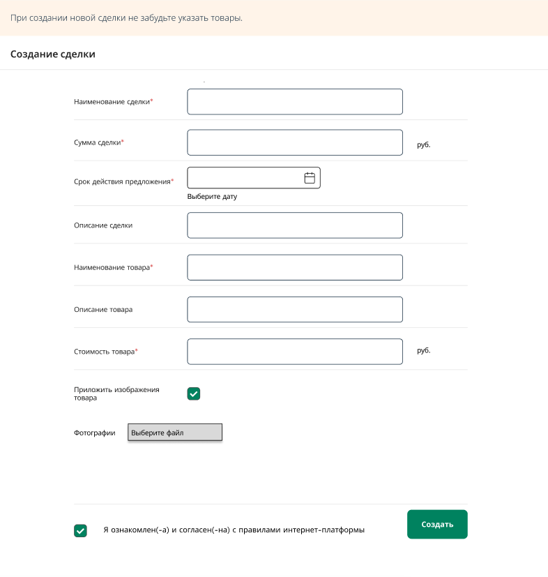

= Техническое задание на разработку функционала процесса создания сделки системы интернет-платформы сделок купли-продажи цифровых или физических товаров/услуг
:author: Муратова А.С.
:revnumber: 1.0
:revdate: 2026-04-02

[cols="1,1,2,3", options="header"]
|===
| Версия | Дата | Автор | Описание изменений
| 1.0 | 2026-04-02 | Муратова А.С. | Начальная версия
|===

== 1. Введение

=== 1.1 Цель документа
Настоящий документ определяет функциональные и технические требования к разработке отдельной части системы, затрагивающей процесс создания сделки системы интернет-платформы сделок купли-продажи цифровых или физических товаров/услуг.

=== 1.2 Область применения
Система используется продавцами интернет-платформы для создания сделок.

=== 1.3 Определения и сокращения
|===
| Термин | Определение
| Сделка (Deal) | Сущность, содержащая информацию о сделке: сумма сделки, наименование сделки, срок действия предложения, статус сделки, подробное описание сделки, список товаров, количество,  данные продавца
| Продавец (Seller) | Зарегистрированный пользователь, оформляющий сделку
| Статус сделки (Deal Status) | Текущее состояние сделки в процессе выполнения (Создано, Подтверждено, Деньги заморожены, Отменено, Завершено)
| API | Интерфейс для взаимодействия между клиентской частью и бэкендом
|===

== 2. Требования к Frontend

=== 2.1 Сценарии использования

==== Сценарий 1: Создание сделки
[cols="1,4a"]
|===
| ID | 1
| Автор | Муратова Анастасия
| Название | Создание сделки
| Действующее лицо | Продавец
| Предусловие | Продавец инициировал создание сделки
| Триггер | Продавец нажал кнопку "Создать сделку"
| Основной поток |
. Продавец на главной странице интернет-платформы нажимает «Создать сделку».
. Система запрашивает данные по сделке (сумму, наименование, срок сделки, описание, данные о товарах).
. Продавец заполняет форму и выбирает нажимает "Создать".
. Система проверяет корректность данных.
. Система создаёт сделку со статусом «Создано» и отображает ИД сделки.
. Продавец перенаправляется на главную страницу интернет-платформы.
| Расширение |
. Продавец нажимает кнопку "Добавить изображение".
. Система открывает модальное окно для выбора способа добавления изображения (загрузка с устройства, добавление с Google Диска, добавление с Yandex Диска, указание URL)
. Продавец выбирает один из предложенных вариантов и добавляет изображение (-я).
. Система проверяет корректность данных.
|===

=== 2.2 Описание макетов интерфейса
Макеты приведены в https://www.figma.com/site/TayLgtwuYoCJZmBIHQqgUL/Untitled?node-id=3-2068&t=mvbfEgpL4YRN8HfT-0/[Figma].

==== Экран списка заказов

Описание экранной формы:
[cols="1,2,3,4", options="header"]
|===
| № | Параметр | Источник данных | Описание поведения
| 1 | Заголовок | - | Отображается всегда +
Текст: Создание сделки
| 2 | Лейбл | Параметр body метода POST /deals: deal.name | Отображается всегда +
Текст: Наименование сделки* +
Поле обязательно к заполнению
| 3 | Лейбл | Параметр body метода POST /deals: deal.amount | Отображается всегда +
Текст: Сумма сделки* +
Поле обязательно к заполнению
| 4 | Лейбл | Параметр body метода POST /deals: deal.duration | Отображается всегда +
При нажатии на иконку календаря система открывает календарь, где пользователь выбирает дату +
Текст: Срок действия предложения* +
Поле обязательно к заполнению
| 5 | Лейбл |  | Отображается всегда +
Текст: Выберите дату
| 6 | Лейбл | Параметр body метода POST /deals: deal.description | Отображается всегда +
Текст: Описание сделки
| 7 | Лейбл | Параметр body метода POST /deals: deal.products[].name | Отображается всегда +
Текст: Наименование товара* +
Поле обязательно к заполнению
| 8 | Лейбл | Параметр body метода POST /deals: deal.products[].description | Отображается всегда +
Текст: Описание товара
| 9 | Лейбл | Параметр body метода POST /deals: deal.products[].amount | Отображается всегда +
Текст: Стоимость товара* +
Поле обязательно к заполнению
| 10 | Чекбокс |  | Отображается всегда +
Текст: Приложить изображения товара
| 11 | Лейбл | Параметр body метода POST /deals: deal.products[].images[].imageFile + deal.products[].images[].imageName | Отображается только при активном чекбоксе "Приложить изображения товара" +
Текст: Фотографии
| 12 | Кнопка |  | Отображается только при активном чекбоксе "Приложить изображения товара" +
Текст: Выберите файл +
Система вызывает модальное окно с выбором источника изображений. Пользователь выбирает источник изображений и прикрепляет необходимые файлы
| 13 | Чекбокс |  | Отображается всегда +
Текст: Я ознакомлен(-а) и согласен(-на) с правилами интернет-платформы
| 14 | Кнопка | Вызов метода POST /deals с переданными параметрами | Отображается активной, когда все обязательные поля на форме заполнены и отображается неактивной, если не все обязательные поля на форме заполнены +
Текст: Создать
|===

== 3. Требования к Backend

=== 3.1 Описание базы данных

==== Таблица `seller` (Продавец)
Хранит информацию о зарегистрированных продавцах.

[cols="1,2,3,4,5", options="header"]
|===
| Поле       | Тип           | Ограничения      | Описание                               | Пример
| seller_id  | SERIAL        | PRIMARY KEY      | Уникальный идентификатор продавца      | 1
| name       | VARCHAR(200)  |                  | Полное имя продавца                    | "Иван Петров"
| phone      | VARCHAR(20)   | UNIQUE, NOT NULL | Номер телефона в международном формате | "+71234567890"
| email      | VARCHAR(255)  | UNIQUE, NOT NULL | Адрес электронной почты                | "ivan@example.com"
| login      | VARCHAR(30)   | NOT NULL         | Логин                                  | "ivanivanov"
| password   | VARCHAR(50)   | NOT NULL         | Пароль                                 | "G&_Myj15Dbfh^"
| created_at | TIMESTAMP     | DEFAULT NOW()    | Дата и время регистрации               | "2025-04-02 12:00:00"
|===

**Индексы:**

* `phone` (для быстрого поиска по телефону)
* `email` (для поиска по email)

==== Таблица `buyer` (Покупатель)
Хранит информацию о зарегистрированных покупателях.

[cols="1,2,3,4,5", options="header"]
|===
| Поле       | Тип           | Ограничения      | Описание                               | Пример
| buyer_id   | SERIAL        | PRIMARY KEY      | Уникальный идентификатор покупателя    | 1
| name       | VARCHAR(200)  |                  | Полное имя покупателя                  | "Иван Петров"
| phone      | VARCHAR(20)   | UNIQUE, NOT NULL | Номер телефона в международном формате | "+71234567890"
| email      | VARCHAR(255)  | UNIQUE, NOT NULL | Адрес электронной почты                | "ivan@example.com"
| login      | VARCHAR(30)   | NOT NULL         | Логин                                  | "ivanivanov"
| password   | VARCHAR(50)   | NOT NULL         | Пароль                                 | "G&_Myj15Dbfh^"
| created_at | TIMESTAMP     | DEFAULT NOW()    | Дата и время регистрации               | "2025-04-02 12:00:00"
|===

**Индексы:**

* `phone` (для быстрого поиска по телефону)
* `email` (для поиска по email)

==== Таблица `deal` (Сделка)
Содержит основную информацию о сделке.

[cols="1,2,3,4,5", options="header"]
|===
| Поле       | Тип           | Ограничения                      | Описание                               | Пример
| deal_id    | SERIAL        | PRIMARY KEY                      | Уникальный идентификатор сделки        | 1
| seller_id  | SERIAL        | FOREIGN KEY (seller.seller_id)   | Уникальный идентификатор продавца      | 1
| buyer_id   | SERIAL        | FOREIGN KEY (buyer.buyer_id)     | Уникальный идентификатор покупателя    | 1
| amount     | DECIMAL(7,2)  | NOT NULL                         | Сумма сделки                           | "15500"
| name       | VARCHAR(100)  | NOT NULL                         | Название сделки                        | "Беспроводные наушники"
| duration   | TIMESTAMP     | NOT NULL                         | Срок действия предложения              | "2025-04-02 12:00:00"
| deal_status| ENUMIRATION   | NOT NULL                         | Статус                                 | 1
| description| VARCHAR(100)  | NOT NULL                         | Пароль                                 | "Нереальное шумоподавление и звучание"
| created_at | TIMESTAMP     | DEFAULT NOW()                    | Дата и время создания сделки           | "2025-04-02 12:00:00"
| update_date| TIMESTAMP     | DEFAULT NOW()                    | Дата и время обновления сделки         | "2025-04-02 12:00:00"
|===

**Перечень статусов (статусная модель):**

* `create` – создана новая сделка, ожидает подтверждения со стороны Покупателя
* `confirmed` – сделка подтверждена со стороны Покупателя
* `bloked_money` – Покупатель оплатил сделку
* `confirmed_product` – Покупатель подтвердил получение товара
* `cancel` – сделка отменена по инициативе любой из сторон
* `close` - сделка закрыта

**Индексы:**

* `seller_id` (для получения сделок конкретного Продавца)
* `deal_status` (для фильтрации по статусу)
* `created_at` (для сортировки по дате)

==== Enumiration `DealStatuses` (Статусы сделки)
Содержит статусы, описывающие состояние сделки.

[cols="1,2,3", options="header"]
|===
| Code    | Value             | Описание
| 1       | create            | Создано
| 2       | confirmed         | Подтверждено
| 3       | bloked_money      | Деньги заморожены
| 4       | confirmed_product | Подтверждено получение товара
| 5       | cancel            | Отменено
| 6       | close             | Завершено
|===

==== Таблица `product` (товар)
Содержит товары, входящие в сделку, с ценой на момент сделку.

[cols="1,2,3,4,5", options="header"]
|===
| Поле           | Тип           | Ограничения      | Описание                                       | Пример
| product_id     | SERIAL        | PRIMARY KEY      | Уникальный идентификатор товара                | 1
| product_status | INTEGER       |                  | Статус получения/отправки товара               | 1
| name           | VARCHAR(100)  | NOT NULL         | Наименование товара                            | "Беспроводные наушники"
| description    | VARCHAR(100)  | NOT NULL         | Описание                                       | "Максимально автономны"
| amount         | DECIMAL(7,2)  | NOT NULL         | Цена одной единицы на момент создания сделки   | 1500.50
|===

**Индексы:**

* `name` (для поиска по названию)

==== Таблица `deal_line` (Товары, присутствующие в сделке)
Содержит товары, которые приходятся на одну сделку.

[cols="1,2,3,4,5", options="header"]
|===
| Поле           | Тип           | Ограничения                      | Описание                                       | Пример
| deal_line_id   | SERIAL        | PRIMARY KEY                      | Автоинкремент                                  | 1
| deal_id        | SERIAL        | FOREIGN KEY (deal.deal_id)       | Уникальный идентификатор сделки                | 1
| product_id     | SERIAL        | FOREIGN KEY (product.product_id) | Уникальный идентификатор товара                | 1
| product_count  | INTEGER       |                                  | Количество единиц товара в сделке              | 10
|===

**Уникальное ограничение:** уникальность пары (deal_id, product_id) гарантирует, что один товар не будет добавлен в сделку дважды.

==== Таблица `image` (изображение)
Содержит ссылки на изображения товаров.

[cols="1,2,3,4,5", options="header"]
|===
| Поле           | Тип           | Ограничения         | Описание                                       | Пример
| image_id       | SERIAL        | PRIMARY KEY         | Уникальный идентификатор изображения           | 1
| image_link     | VARCHAR(100)  | NOT NULL            | Ссылка на изображение                          | "https://drive.google.com/drive/images/image_1.png"
| image_name     | VARCHAR(100)  | NOT NULL            | Наименование изображения                       | "image_1.png"
| created_at     | TIMESTAMP     | DEFAULT NOW()       | Дата и время загрузки изображения              | "2025-04-02 12:00:00"
| update_date    | TIMESTAMP     | DEFAULT NOW()       | Дата и время обновления изображения            | "2025-04-02 12:00:00"
|===

**Индексы:**

* `image_name` (для поиска по названию)

==== Таблица `image_line` (Перечень изображений товаров)
Содержит перечень изображенний товаров.

[cols="1,2,3,4,5", options="header"]
|===
| Поле           | Тип           | Ограничения                      | Описание                                       | Пример
| image_line_id  | SERIAL        | PRIMARY KEY                      | Автоинкремент                                  | 1
| image_id       | SERIAL        | FOREIGN KEY (image.image_id      | Уникальный идентификатор изображения           | 1
| product_id     | SERIAL        | FOREIGN KEY (product.product_id) | Уникальный идентификатор товара                | 1
| image_count    | INTEGER       |                                  | Количество фотографий товара                   | 5
|===

**Уникальное ограничение:** уникальность пары (image_id, product_id) гарантирует, что одно изображение товара не будет добавлено дважды.

=== 3.2 Описание API эндпоинтов

[cols="1,2,3,4", options="header"]
|===
| Метод | Эндпоинт | Описание | Доступ
| POST | /api/deals | Создать новую сделку | Продавец
|===

==== 3.2.1 POST /api/deals
**Описание:** Создание новой сделки продавцом

**URL:** `/api/deals`

**Метод:** `POST`

**Аутентификация:** Требуется BearerAuth в заголовке `Authorization`

===== Параметры запроса
Указываются в body:

[cols="1,2,3,4", options="header"]
|===
| Параметр | Тип | Обязательный | Описание
| sellerId | integer | да | Идентификатор продавца
| deal.amount | string | да | Сумма сделки
| deal.name | string | да | Наименование сделки
| deal.duration | string | да | Срок действия предложения (в формате YYYY-MM-DD)
| deal.description | string | нет | Описание сделки
| deal.products.name | string | да | Наименование товара
| deal.products[].description | string | нет | Описание товара
| deal.products[].amount | string | нет | Стоимость товара
| deal.products[].images[].imageFile | binary | нет | Файл изображения товара
| deal.products[].images[].imageName | string | нет | Название файла изображения товара
|===

===== Пример запроса
[source,http]
----
POST /api/deals
Authorization: BearerAuth
Body:
{
    "sellerId": 123,
    "deals": {
        "amount": "62600.00",
        "name": "Беспроводные наушники APPLE AirPods Max Gen 2 Purple",
        "duration": "2026-05-15T14:30:00Z",
        "description": "AirPods Max для меломанов и не только\nСтильный дизайн и комфорт\nНереальное шумоподавление и звучание\nПросты в управлении\nМаксимально автономны",
        "products": [
            {
                "name": "Беспроводные наушники APPLE AirPods Max Gen 2 Purple",
                "description": "AirPods Max для меломанов и не только\nСтильный дизайн и комфорт\nНереальное шумоподавление и звучание\nПросты в управлении\nМаксимально автономны",
                "amount": "62600.00",
                "images": [
                    {
                        "imageFile": "AirPods.jpg",
                        "imageName": "AirPodsMaxGen2Purple"
                    }
                ]
            }
        ]
    }
}
----

===== Параметры ответа
[cols="1,2,3,4", options="header"]
|===
| Поле | Тип | Описание | Пример
| id | integer | Уникальный идентификатор сделки | `12345`
|===

===== Пример ответа
[source,json]
----
{
    "id": 12345
}
----

===== Коды ошибок
[cols="1,2,3", options="header"]
|===
| Код | Статус | Описание
| 200 | Success | Сделка успешно создана
| 400 | Bad Request | Невалидные данные (например, отсутствует deals)
| 401 | Unauthorized | Требуется авторизация
| 403 | Forbidden | Нет прав на создание сделки
| 404 | Not Found | Указанный seller_id = input sellerId не найден
| 500 | Internal Server Error | Ошибка сервера
|===

===== Логика работы
1. *Проверка данных авторизации пользователя*

* Если пользователь авторизован, то система переходит на следующий шаг.
* Если пользователь не авторизован, то возвращается ошибка 401.

2. *Проверка прав доступа*

* Если роль пользователя – `seller`, то система переходит на следующий шаг.
* Если роль – `buyer`, `guest`, или `admin`, возвращается ошибка 403.

3. *Проверка существования продавца в системе*

* Если sellerId найден в системе, то система переходит на следующий шаг.
* Если sellerId не найден в системе, то возвращается ошибка 404.

4. *Проверка тела запроса на валидность*

===== Условия проверок тела запроса
[cols="1,2,3", options="header"]
|===
| Параметр | Условие | Ошибка
| sellerId | Если пришел пустой параметр | Ошибка 404 с сообщением “Указанный seller_id = input sellerId не найден”
| deal | Если пришел пустой параметр | Ошибка 400 с сообщением “Параметр deal не валиден”
| deal.amount | 1. Если пришел пустой параметр +
2. Стоимость вводимого параметра < 0 +
3. Стоимость вводимого параметра = 0 | Ошибка 400 с сообщением “Параметр deal.amount не валиден”
| deal.name | 1. Если пришел пустой параметр +
2. Длина вводимого названия сделки больше 100 символов | Ошибка 400 с сообщением “Параметр deal.name не валиден”
| deal.duration | 1. Если пришел пустой параметр +
2. Дата вводимого параметра < текущей даты +
3. Дата вводимого параметра = текущей дате | Ошибка 400 с сообщением “Параметр deal.duration не валиден”
| deal.products | Если пришел пустой параметр | Ошибка 400 с сообщением “Параметр deal.products не валиден”
|===

* Если данные валидны, то система переходит на следующий шаг.
* Если данные не валидны, то возвращается ошибка 400.

5. *Создание записи в таблице deal*

* deal.deal_id = автоинкремент
* deal.seller_id = input sellerId
* deal.amount = input deal.amount
* deal.name = input deal.name
* deal.duration = input deal.duration
* deal.deal_status = 1 (“create”)
* deal.description = input deal.description (если передан, иначе NULL)
* deal.create_date = текущая дата и время
* deal.update_date = текущая дата и время

6. *Создание записи в таблице product*

* product.product_id = автоинкремент
* product.product_status = 1 (“attached”)
* product.name = input deal.products.name (если передан)
* product.description =  input deal.products.description (если передан)
* product.amount = input deal.products.amount (если передан)

7. *Создание записи в таблице deal_line*

* deal_line.deal_line_id = автоинкремент
* deal_line.deal_id = deal.deal_id
* deal_line.product_id = product.product_id
* deal_line.product_count =  count (input deals.products) (если передан)

8. *Создание записи в таблице image*

* image.image_id = автоинкремент
* image.deal_id = deal.deal_id
* image.image = input deal.products.images.imageFile (если передан)
* image.image_name =  input deal.products.images.imageName (если передан)

9. *Формирование ответа*

* Система возвращает ответ с созданным ИД сделки deal.deal_id на шаге 5 текущего алгоритма и код успеха 200.
* Если сервис не отвечает, то возвращается ошибка 500.
